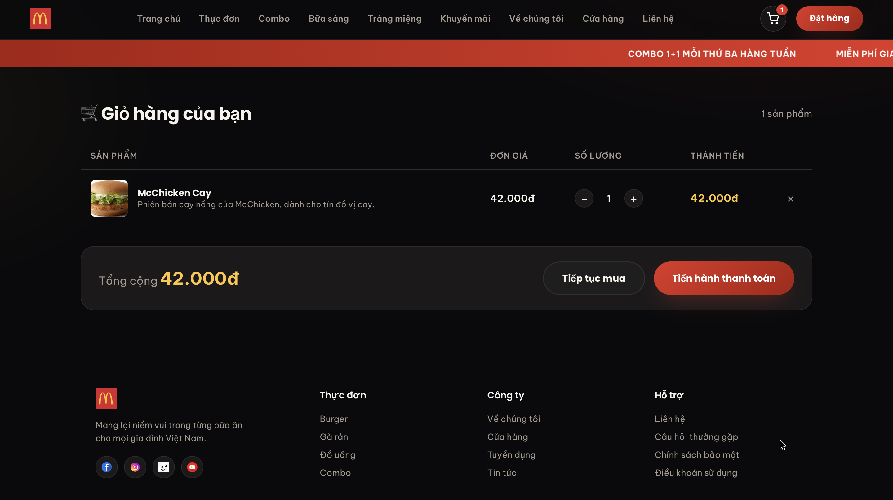
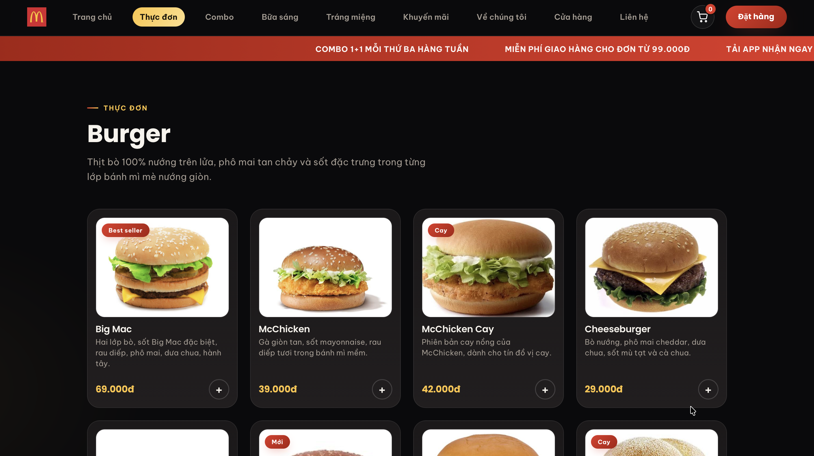
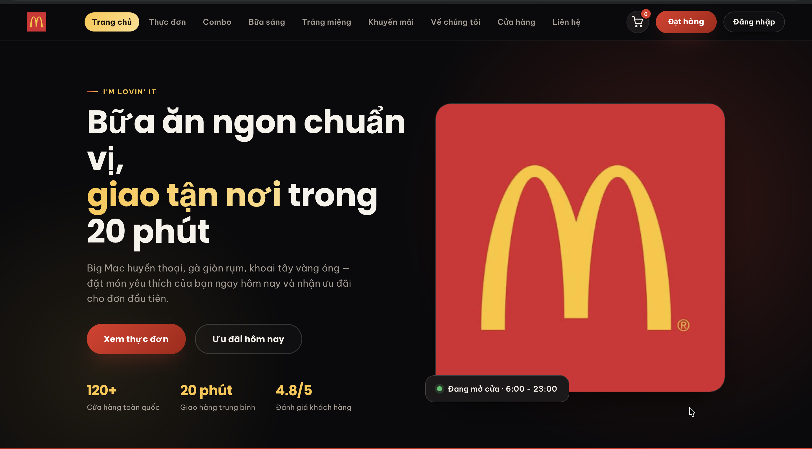

MCDONALD'S VIET NAM - WEBSITE DAT MON TRUC TUYEN

Du an mon Cong nghe Web - Nhom 06

1. INTRODUCTION (GIOI THIEU)

Chao mung ban den voi du an "McDonald's Viet Nam" - mot website mo phong he thong dat mon va gioi thieu san pham cua chuoi nha hang McDonald's.

Du an duoc xay dung bang cac cong nghe web co ban: HTML5, CSS3 va JavaScript thuan (Vanilla JS). Muc dich cua du an nham tao ra mot giao dien nguoi dung than thien, cho phep khach hang de dang tim hieu thuc don, cac chuong trinh khuyen mai va dat mon thong qua mo hinh gio hang mo phong.

2. SYSTEM REQUIREMENTS (YEU CAU HE THONG)

De su dung va kiem tra website, nguoi dung can dap ung cac yeu cau toi thieu sau:

- Trinh duyet Web: Google Chrome (phien ban 110+), Microsoft Edge, Mozilla Firefox, hoac Safari (phien ban moi nhat).
- Ket noi Internet: Can co ket noi mang on dinh de tai trang web, hinh anh va tai nguyen.
- He dieu hanh: Tuong thich voi moi he dieu hanh (Windows, macOS, iOS, Android) thong qua trinh duyet web.

3. HOW TO ACCESS THE WEBSITE (CACH TRUY CAP)

Website da duoc xuat ban (deploy) len moi truong GitHub Pages va co the truy cap cong khai thong qua duong dan sau:

[https://letrandongquan.github.io/mcdonalds-web-group06/](https://letrandongquan.github.io/mcdonalds-web-group06/)

4. FEATURES OVERVIEW (TONG QUAN TINH NANG)

Website cung cap cac tinh nang chinh sau:

- Trang chu: Gioi thieu thuong hieu, cac mon an noi bat va thong ke cua hang.
- Thuc don: Hien thi chi tiet danh sach cac mon (Burger, Ga ran, Do uong) kem gia tien.
- Combo: Cung cap cac goi combo tiet kiem voi muc gia uu dai.
- Bua sang va Trang mieng: Phan loai mon an theo nhu cau va khung gio cu the.
- Khuyen mai: Cap nhat cac chuong trinh giam gia va uu dai hap dan.
- He thong cua hang: Hien thi danh sach cua hang va tich hop ban do Google Maps.
- Gio hang: Tinh nang mo phong cho phep nguoi dung them mon vao gio va theo doi so luong san pham.

5. STEP-BY-STEP INSTRUCTIONS (HUONG DAN TUONG BUOC)

1. Xem thuc don:
   Nhap vao muc "Thuc don" tren thanh dieu huong. Keo xuong duoi de xem cac danh muc con (Burger, Ga ran, Do uong).

2. Them mon vao gio hang:
   Tai moi mon an hoac combo, nhap vao nut "+" (mau do) de them san pham vao gio hang.

3. Kiem tra gio hang:
   Nhap vao bieu tuong xe day o goc phai thanh menu (hoac bam vao nut gio hang noi o goc duoi cung ben phai man hinh) de xem danh sach mon da chon.

4. Dat hang (Mo phong):
   Sau khi da chon mon, nhap vao nut "Dat hang" tren thanh menu. Hien tai tinh nang dang dung o buoc mo phong. 
6. SCREENSHOTS (HINH ANH MINH HOA)

- Hinh 1: gio hang
  

- Hinh 2: Menu
  

- Hinh 3: trang chu
  

7. KNOWN LIMITATIONS (HAN CHE HIEN TAI)

- Hien tai, he thong chua tich hop Backend (Xu ly thanh toan thuc te) va chua ket noi voi co so du lieu.
- Du lieu gio hang hien chi luu tru tam thoi tren trinh duyet va se tro ve 0 khi nguoi dung tai lai trang (chua su dung LocalStorage de luu tru vinh vien).

8. SUBMISSION CHECKLIST (DANH SACH KIEM TRA TRUOC KHI NOP)

Truoc khi nop bao cao, nhom da kiem tra va xac nhan cac muc sau:

1. Website da duoc xuat ban len GitHub Pages va chay duoc bang link cong khai. (Dat)
2. Repository tren GitHub da dat che do Public (Cong khai). (Dat)
3. Tat ca cac lien ket (Link dieu huong, Link hinh anh, CSS/JS) deu hoat dong (Khong bi loi 404). (Dat)
4. File PDF/Word bao cao (User Guide) da hoan thien day du cac muc yeu cau. (Dat)
5. Da dan chinh xac duong dan URL Website vao muc "Published Website URL" trong bai nop. (Dat)

(c) 2026 Nhom 06 - Du an Cong nghe Web. Moi quyen duoc bao luu.
Trang web demo phuc vu muc dich hoc tap va phi loi nhuan.
